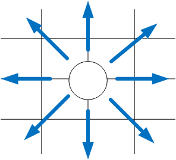
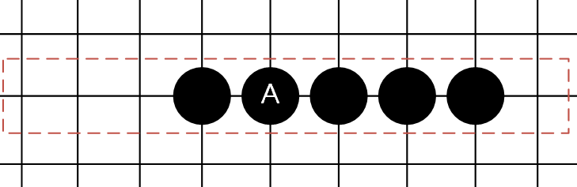
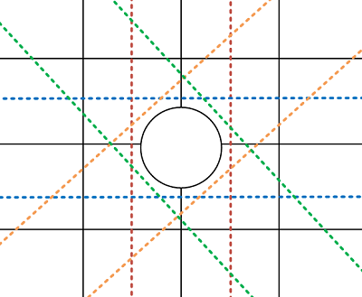

# 第 46 課 - 五子棋小遊戲 (七) - 簡單勝利判斷

題目：

1. 嘗試解決最後棋子下在五顆連線的中間，而不是邊邊時無法判斷勝利的 bug
2. 嘗試實作重新啟動遊戲的功能
3. 在有人快勝利時提出警告訊息
4. 想出一個方法讓白色自動下子 (例如：最簡單的作法，隨便找個讓白色隨機亂下)

目前先放上第一道題目解答，其他解答則日後補上。

## 第一題：解決勝利判斷 Bug

在本課教學中我們說明了一種判斷勝利的做法，其概念是以最後下子的棋子為中心，然後向周邊的八個方向檢查是否有連續四顆相同顏色的棋子，來達到判斷勝利的效果 (如下圖一)。



圖一、原本設計的檢查方式

然而這個做法卻無法判斷下子位置是在五子之中的中間的情況。

這是因為我們原先的判斷方式有一個隱含的假設：

```
假設造成勝利的棋子一率都是在連續五子中的尾端。
```

為了修正這個 bug，我們必須考慮最後一子不是在五子兩端，而是會出現在正中間的情況。

修正的方法並不難，因為不要忘記最後下子的棋子一定還是會在連續五子的某個位置，只是不一定在尾端而已。

因此我們可以改成不是以「最後下子的位置為尾端出發」，而是檢查所有「通過最後下子位置的直線」。

例如我們考慮下圖的情況。



圖二、檢查直線上的五子範例

假設我們最後下子的位置是在 A，我們可以看出他其實已經構成了五子的勝利條件了。但是舊方法因為只朝一個方向檢查，所以無論從 A 往左或往右檢查總是會漏掉一邊的棋子。

那我們檢查的時候只要單純地從 A 子左側四子的位置開始往右檢查到右側四子的位置，那就一定可以把這五子都抓出來。從圖上來看就是檢查框框框起來的位置。

如果將這段邏輯寫成程式碼的話，大概就像下面這樣 (假設只檢查一個方向)：

```c#
// 紀錄連續看到現在玩家下子的棋子數量
int count = 0;

// 依序檢查下子位置左側四子到右側四子共九顆棋子
for (int checkOffset = -4; checkOffset <= 4; checkOffset++)
{
    int targetX = centerX + checkOffset;
    int targetY = centerY;

    // 發現不同顏色的棋子就把計數歸零
    if (targetX < 0 || targetX >= Board.NODE_COUNT ||
        targetY < 0 || targetY >= Board.NODE_COUNT ||
        board.GetPieceType(targetX, targetY) != currentPlayer)
    {
        count = 0;
    }
    else
    {
        // 看到相同顏色的棋子就紀錄下來
        count++;

        // 如果看到五子就記錄勝利者，並終止迴圈
        if (count == 5)
        {
            winner = currentPlayer;
            break;
        }
    }
}
```

這就是修正這個 bug 的方式！

最後只要再將這個方式擴展到所有通過 A 子的直線上就好，也就是下圖中的四條直線。



圖三、所有通過 A 子的直線 (用四個虛線的框框框起來)

大家如果理解上面的做法的話，可以自行嘗試看看如何寫出延伸到四條線的做法。

那這邊就提供一種 `CheckWinner()` 的寫法，細節的話就請各位自行琢磨看看：

```c#
private void CheckWinner()
{
    int centerX = board.LastPlacedNode.X;
    int centerY = board.LastPlacedNode.Y;

    // 檢查四條線，每一條線各從一端沿一個方向前進
    // 這邊我們採用 (0, 1), (1, 1), (1, 0), (1, -1) 四個方向
    for (int xDir = 0; xDir <= 1; xDir++) {
        for (int yDir = -1; yDir <= 1; yDir++)
        {
            // 去除不需要跑的方向
            if ((xDir == 0 && yDir == 0) ||
                (xDir == 0 && yDir == -1))
                continue;

            // 紀錄連續看到現在玩家下子的棋子數量
            int count = 0;
            
            // 依序檢查直線上的九顆棋子
            for (int checkOffset = -4; checkOffset <= 4; checkOffset++)
            {
                int targetX = centerX + checkOffset * xDir;
                int targetY = centerY + checkOffset * yDir;

                // 發現不同顏色的棋子就把計數歸零
                if (targetX < 0 || targetX >= Board.NODE_COUNT ||
                    targetY < 0 || targetY >= Board.NODE_COUNT ||
                    board.GetPieceType(targetX, targetY) != currentPlayer)
                {
                    count = 0;
                }
                else
                {
                    // 看到相同顏色的棋子就紀錄下來
                    count++;

                    // 如果看到五子就記錄勝利者，並終止迴圈
                    if (count == 5)
                    {
                        winner = currentPlayer;
                        return;
                    }
                }
            }
        }
    }
}
```
